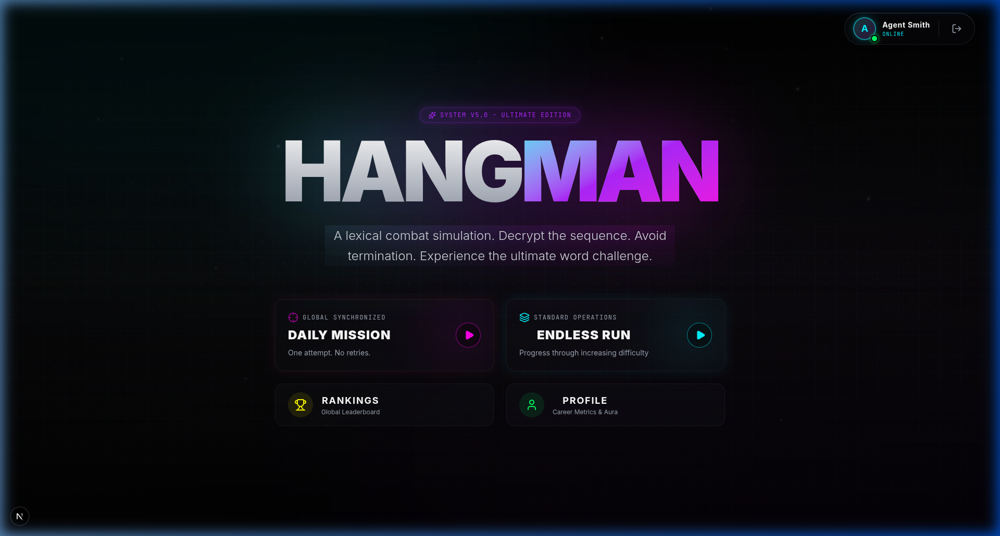
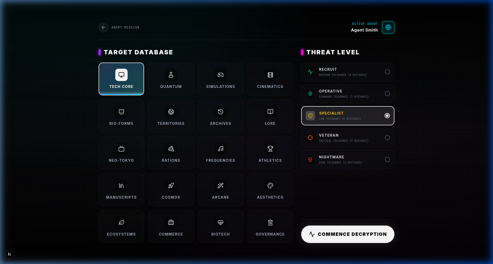
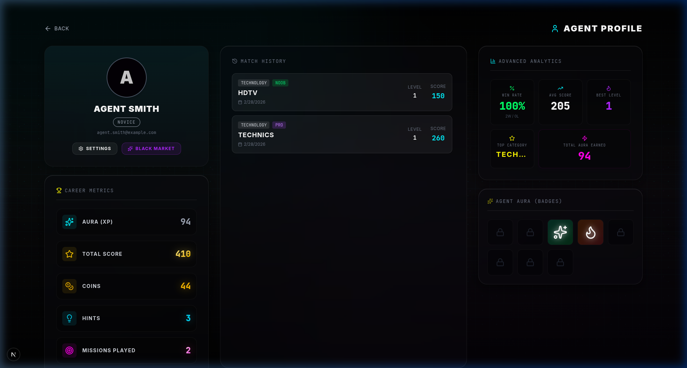

<div align="center">

# ⚡ NEON HANGMAN ⚡

### *A Cyberpunk Word-Guessing Experience*


A modern, fully-featured Hangman game wrapped in a stunning **neon cyberpunk** aesthetic. Built with **Next.js 15**, **Firebase**, **Zustand**, and **Framer Motion** — featuring animated backgrounds, daily challenges, achievements, a global leaderboard, an in-game shop, and much more.

<br>



</div>

---

## 📸 Screenshots

<div align="center">
<table>
<tr>
<td align="center"><strong>🏠 Home Screen</strong></td>
<td align="center"><strong>🎯 Mission Setup</strong></td>
</tr>
<tr>
<td></td>
<td></td>
</tr>
<tr>
<td align="center"><strong>👤 Agent Profile</strong></td>
<td align="center"><strong>⚡ Animated UI</strong></td>
</tr>
<tr>
<td></td>
<td></td>
</tr>
</table>
</div>

---

## ✨ Features

### 🎮 Core Gameplay
- **Classic Hangman** with a cyberpunk twist — guess letters to decode the target word
- **20 Word Categories** — Technology, Science, Animals, Movies, Music, Sports, History, Mythology, Anime, Food, Gaming, Geography, Literature, Space, Magic, Art, Nature, Business, Medicine & Politics
- **5 Difficulty Levels** — Noob (8 lives) → Casual (7) → Pro (6) → Veteran (5) → Godlike (4)
- **Combo System** — Chain correct guesses to multiply your score
- **Multi-Level Sessions** — Win and advance to the next level without losing progress
- **Animated Hangman Figure** — A fully animated neon-styled hangman with glowing effects

### 🏆 Progression & Rewards
- **Aura XP System** — Earn Aura from victories to rank up through tiers
- **4 Ranking Tiers** — Novice → Hacker → Cyber-God → Neon Legend
- **Coins Economy** — Earn coins from wins and spend them in the shop
- **Hint System** — Purchase global hint packs or use free services during missions
- **8 Achievements** — First Blood, Veteran Agent, Flawless Execution, Combo Master, Cyber-Godlike, Close Call, High Roller & Persistence

### 📅 Daily Challenge
- **Unique Daily Word** — A new word every day synced across all players
- **Streak Tracking** — Track your daily completion streak
- **Daily Leaderboard** — Compete for the best daily score

### 🛍️ In-Game Shop
- **Sound Packs** — Cyberpunk Synth Pack, Mechanical Keyboard
- **Avatar Borders** — Toxic Radiation, Plasma Core
- **Consumables** — Global Hint Pack (x3)

### 🏅 Global Leaderboard
- **Real-time Rankings** — See how you stack up against all players
- **Career Statistics** — Games played, win rate, best score, and more
- **Tier Badges** — Display your rank with animated neon borders

### 🔐 Authentication
- **Firebase Auth** — Secure email/password and Google Sign-In
- **Cloud Sync** — All progress saved to Firestore in real-time
- **Guest Mode** — Play without signing in (progress not saved)

### 🎨 Design & UX
- **Neon Cyberpunk Aesthetic** — Dark theme with glowing neon accents
- **Animated Background** — Dynamic particle effects and floating elements
- **Smooth Animations** — Powered by Framer Motion throughout
- **Responsive Design** — Fully playable on desktop and mobile
- **Sound Effects** — Immersive audio feedback with customizable sound packs
- **Glassmorphism UI** — Modern frosted-glass panels and cards

---

## 🛠️ Tech Stack

| Layer | Technology |
|-------|-----------|
| **Framework** | [Next.js 15](https://nextjs.org/) (App Router) |
| **Language** | [TypeScript 5.9](https://www.typescriptlang.org/) |
| **Styling** | [Tailwind CSS 4.1](https://tailwindcss.com/) |
| **State Management** | [Zustand](https://zustand-demo.pmnd.rs/) |
| **Animations** | [Framer Motion](https://www.framer.com/motion/) (via `motion` package) |
| **Auth & Database** | [Firebase](https://firebase.google.com/) (Auth + Firestore) |
| **Icons** | [Lucide React](https://lucide.dev/) |
| **Confetti** | [Canvas Confetti](https://www.kirilv.com/canvas-confetti/) |
| **AI Integration** | [Google GenAI SDK](https://ai.google.dev/) |

---

## 🚀 Getting Started

### Prerequisites

- **Node.js** 18+ and **npm** installed
- A **Firebase** project with Authentication and Firestore enabled

### 1. Clone the Repository

```bash
git clone https://github.com/miyaniakshar1234/neon-hangman.git
cd neon-hangman
```

### 2. Install Dependencies

```bash
npm install
```

### 3. Configure Environment Variables

Copy the example environment file and add your Firebase credentials:

```bash
cp .env.example .env.local
```

Then edit `.env.local` with your Firebase config:

```env
NEXT_PUBLIC_FIREBASE_API_KEY=your_api_key
NEXT_PUBLIC_FIREBASE_AUTH_DOMAIN=your_project.firebaseapp.com
NEXT_PUBLIC_FIREBASE_PROJECT_ID=your_project_id
NEXT_PUBLIC_FIREBASE_STORAGE_BUCKET=your_project.appspot.com
NEXT_PUBLIC_FIREBASE_MESSAGING_SENDER_ID=your_sender_id
NEXT_PUBLIC_FIREBASE_APP_ID=your_app_id
```

### 4. Run the Development Server

```bash
npm run dev
```

Open [http://localhost:3000](http://localhost:3000) in your browser to play!

### 5. Build for Production

```bash
npm run build
npm start
```

---

## 📂 Project Structure

```
neon-hangman/
├── app/                        # Next.js App Router pages
│   ├── page.tsx                # Home page with daily challenge
│   ├── layout.tsx              # Root layout with providers
│   ├── globals.css             # Global styles & design tokens
│   ├── game/                   # Game play page
│   ├── setup/                  # Category & difficulty selection
│   ├── profile/                # User profile & stats
│   ├── leaderboard/            # Global leaderboard
│   ├── shop/                   # In-game shop
│   └── settings/               # App settings
├── components/                 # React components
│   ├── game/                   # Game-specific components
│   │   ├── GameHeader.tsx      # Score, combo, lives display
│   │   ├── GameOverModal.tsx   # Win/lose modal with rewards
│   │   ├── HangmanFigure.tsx   # Animated neon hangman SVG
│   │   ├── Keyboard.tsx        # On-screen keyboard
│   │   └── WordDisplay.tsx     # Word letter display
│   ├── AnimatedBackground.tsx  # Dynamic particle background
│   ├── AuthModal.tsx           # Login/signup modal
│   ├── AuthProvider.tsx        # Firebase auth context
│   └── AchievementToast.tsx    # Achievement unlock notifications
├── lib/                        # Utilities & data
│   ├── data/words/             # 20 category word banks
│   ├── achievements.ts         # Achievement definitions
│   ├── daily.ts                # Daily challenge logic
│   ├── firebase.ts             # Firebase configuration
│   ├── shop.ts                 # Shop item definitions
│   ├── tiers.ts                # Ranking tier definitions
│   ├── utils.ts                # Utility functions
│   └── words.ts                # Word type definitions
├── store/                      # Zustand state stores
│   ├── gameStore.ts            # Game state management
│   └── settingsStore.ts        # App settings state
├── hooks/                      # Custom React hooks
│   ├── useAudio.ts             # Sound effects system
│   └── use-mobile.ts           # Mobile detection
├── scripts/                    # Build scripts
│   └── generate-words.mjs      # Word bank generator
├── .env.example                # Environment template
├── next.config.ts              # Next.js configuration
├── tsconfig.json               # TypeScript configuration
└── package.json                # Dependencies & scripts
```

---

## 🎯 Game Categories

<div align="center">

| | | | |
|:---:|:---:|:---:|:---:|
| 💻 Technology | 🔬 Science | 🐾 Animals | 🎬 Movies |
| 🎵 Music | ⚽ Sports | 📜 History | 🏛️ Mythology |
| 🎌 Anime | 🍕 Food | 🎮 Gaming | 🌍 Geography |
| 📚 Literature | 🚀 Space | 🪄 Magic | 🎨 Art |
| 🌿 Nature | 💼 Business | 🏥 Medicine | 🏛️ Politics |

</div>

---

## 🏅 Difficulty Levels

| Level | Lives | XP Multiplier | Description |
|-------|:-----:|:-------------:|-------------|
| **Noob** | 8 | 1x | For beginners — generous mistakes allowed |
| **Casual** | 7 | 2x | Relaxed gameplay with room for error |
| **Pro** | 6 | 3x | Standard challenge for experienced players |
| **Veteran** | 5 | 5x | High risk, high reward |
| **Godlike** | 4 | 8x | Ultimate challenge — no room for mistakes |

---

## 🏆 Achievement System

| Achievement | Description |
|---|---|
| 🎯 **First Blood** | Complete your first successful mission |
| 🛡️ **Veteran Agent** | Play 10 missions |
| ✨ **Flawless Execution** | Win without making a single mistake |
| 🔥 **Combo Master** | Reach a 5x combo multiplier |
| 💀 **Cyber-Godlike** | Win on Godlike difficulty |
| ❤️ **Close Call** | Win with only 1 life remaining |
| 👑 **High Roller** | Score over 1,000 points in a single mission |
| ⚡ **Persistence** | Reach Level 5 in a continuous session |

---

## 🤝 Contributing

Contributions are welcome! Please read the [Contributing Guidelines](CONTRIBUTING.md) before getting started.

1. Fork the repository
2. Create your feature branch (`git checkout -b feature/amazing-feature`)
3. Commit your changes (`git commit -m 'Add amazing feature'`)
4. Push to the branch (`git push origin feature/amazing-feature`)
5. Open a Pull Request

---

## 📄 License

This project is licensed under the **MIT License** — see the [LICENSE](LICENSE) file for details.

---

## 🔒 Security

For information about reporting security vulnerabilities, please see [SECURITY.md](SECURITY.md).

---

## 📬 Contact

- **GitHub**: [@miyaniakshar1234](https://github.com/miyaniakshar1234)

---

<div align="center">

**Built with ❤️ and ⚡ by [miyaniakshar1234](https://github.com/miyaniakshar1234)**

*Decode the signal. Save the world. 🌐*

</div>
